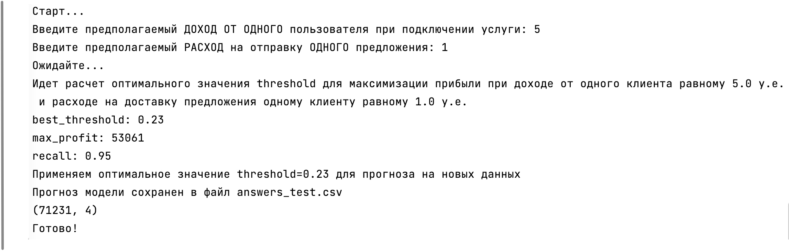

# Курсовой проект от "МегаФон"

### Задача 
#### Необходимо построить  алгоритм, который для каждой пары пользователь-услуга определит вероятность подключения услуги.

---

По-умолчанию при запуске скрипта **без параметров** включается интерактивный режим, в котором можно указать ожидаемые значения дохода от услуги одному клиенту и расхода на доставку предложения одному клиенту. На основании этих данных модель выберет оптимальный threshold для максимизации прибыли и сделает итоговый прогноз по всему датасету.

### Интерактивный способ получения прогноза с автоматическим подбором оптимального значения threshold для максимизации прибыли

    $ cd prediction
    $ python get_pred.py  

---
### Возможные параметры для получения прогноза вручную

--file входной файл для прогноза (должен включать дополнительные фичи)

--to выходной файл для сохранения результатов прогноза (csv)

--threshold ручное выставление значения порога при определении класса (при активном значении автоподбор с максимизацией прибыли отключается)

--pproba при значении 1 модель возвращает не итоговые классы, а вероятности (если указано --pproba 1, то параметр threshold игнорируется)

    $ cd prediction
    $ python get_pred.py --file data_test_feat.csv --to answers_test.csv --threshold 0.48

---
### Пример запроса, для получения вероятностей

    $ cd prediction
    $ python get_pred.py --pproba 1

---
### Презентация проекта в файле
[Presentation_of_the_course_project_from_MegaFon.pdf](Presentation_of_the_course_project_from_MegaFon.pdf)

